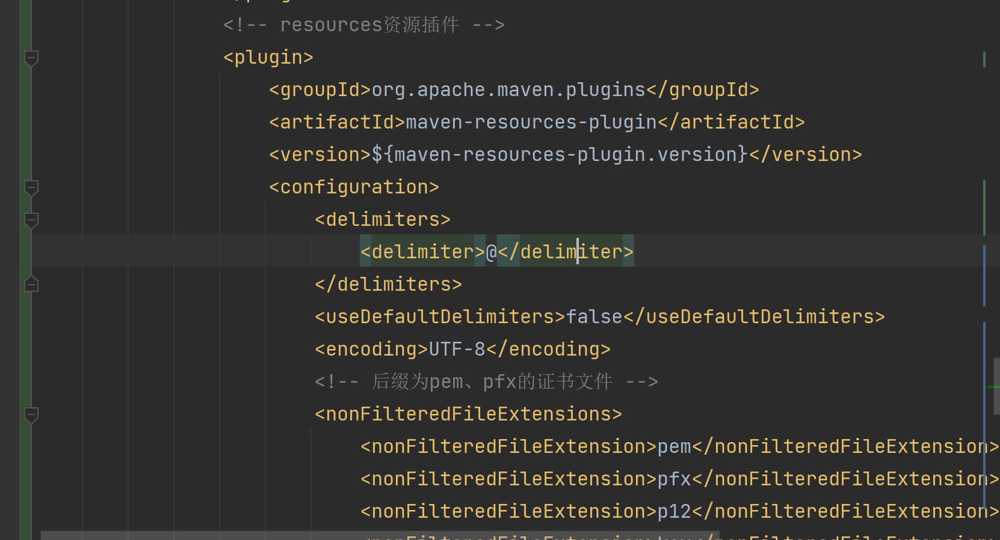
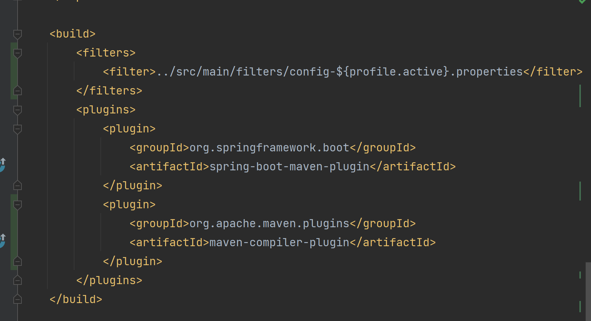

# springCloudAlibaba 心语心愿
## 集成
- 服务注册与发现、配置、总线：nacos
- 服务降级：sentinel
- 服务调用：openfeign
- 服务网关：gateway
- 服务调用：loadBalancer

## 配置指定占位符引入自定义配置文件配置
- 【1】自定配置文件所在项目
- pom.xml配置<plugins>,引入resources资源插件，配置自定义占位符<delimiter>@</delimiter>
- 关闭默认占位符<useDefaultDelimiters>false</useDefaultDelimiters>
- 【2】需要引入自定义配置文件的项目
- pom.xml中<build>标签中引入<filters>标签，配置<filter>../src/main/filters/config-${profile.active}.properties</filter>，路径为自定义配置文件所在位置
### 代码截图

